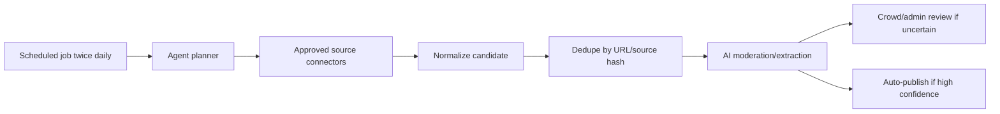

# Agent Ingestion Strategy

## Position

Use agents as research orchestrators, not as stealth scrapers.

An agent can decide what to search, which sources to inspect, how to normalize findings, and when to escalate uncertainty. It should not use browser automation to bypass platform rules, login walls, rate limits, or anti-bot systems.

## Recommended Architecture



## Source Tiers

### Tier 1: API and Explicit Feeds

Use first:

- X official API
- Google Programmable Search / other search APIs where available
- RSS feeds
- university lab pages
- personal websites
- GitHub pages
- mailing list archives
- partner/provider feeds

The agent can run queries such as:

```txt
"PhD position" "machine learning" site:edu
"postdoc" "AI safety" "apply"
"research intern" "robotics" "university"
```

### Tier 2: User-Submitted URLs

Let users submit LinkedIn, X, Xiaohongshu, lab, or newsletter URLs. The agent can then:

- fetch accessible metadata where allowed
- summarize the source text
- check duplicates
- score credibility
- create a pending candidate

### Tier 3: Platform-Restricted Content

For LinkedIn and Xiaohongshu, avoid production browser automation unless there is explicit authorization or a compliant provider.

The agent can still track:

- manually submitted URLs
- public search snippets from approved search APIs
- official/partner APIs
- email or RSS alerts from source owners

## Agent Responsibilities

The agent should:

- maintain a search plan per source
- run twice daily
- collect source URLs and raw snippets
- normalize candidates into the existing post schema
- call AI moderation and extraction
- store source hash for dedupe
- write an audit trail for each candidate
- send uncertain results to crowd/admin review

The agent should not:

- use personal login cookies for scraping
- rotate accounts or proxies to avoid detection
- automate LinkedIn website actions
- scrape X through browser automation instead of the official API
- publish content without source URL and moderation record

## Operational Controls

Add a backend ingestion control plane:

- `ingestionSources`: source name, type, query, cadence, enabled flag
- `ingestionRuns`: start time, status, result count, error message
- `sourceCandidates`: raw URL, raw text/snippet, normalized fields, source hash
- `moderationReviews`: AI/crowd/admin decisions

Minimum launch cadence:

```txt
08:00 local time: broad discovery run
20:00 local time: refresh and stale-check run
```

## Practical Recommendation

Start with agent-driven search over approved sources:

1. X API recent search.
2. Google/search API for lab pages and university pages.
3. RSS/newsletter/lab-page fetchers.
4. User-submitted LinkedIn/X/Xiaohongshu URLs.
5. Licensed provider for Xiaohongshu if needed.

This gives better coverage than manual review while keeping the product defensible.
