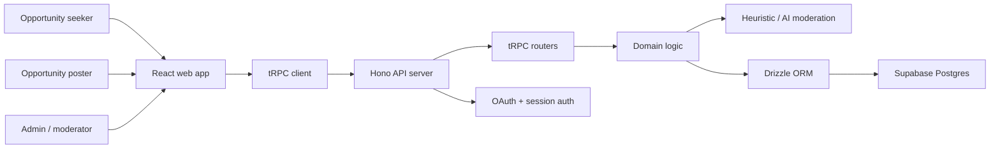
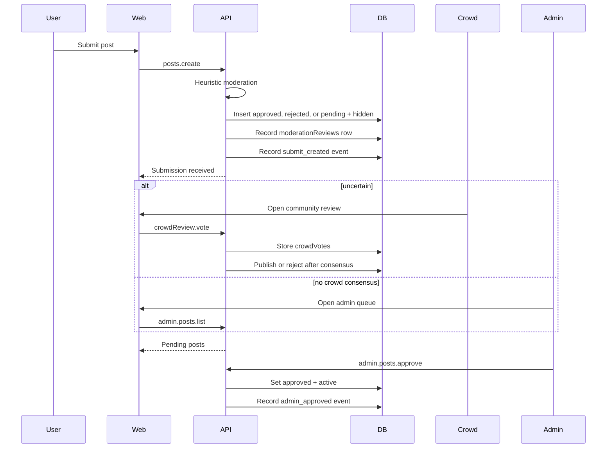
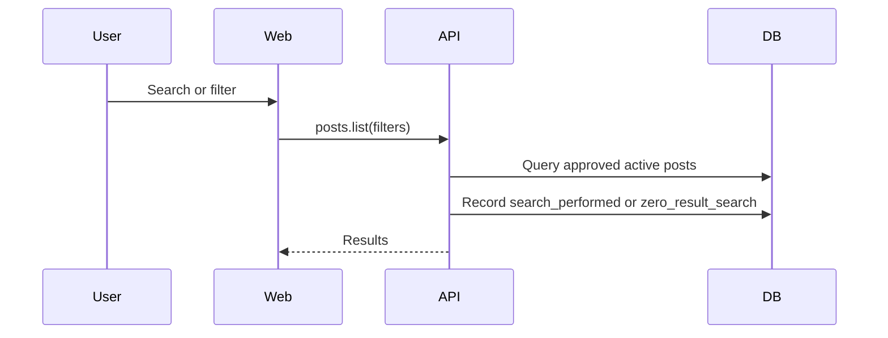
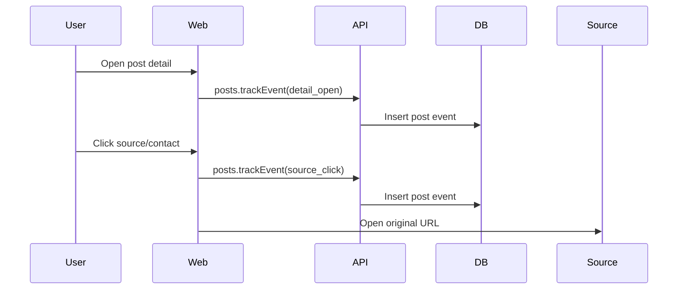
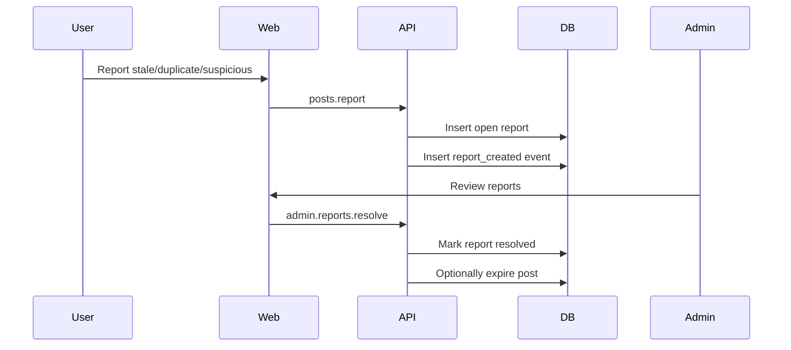

# OpenPosition Technical Architecture

## Purpose

This document defines the target architecture for the V0 Operable MVP. It is grounded in the current codebase and the product goal of turning OpenPosition from a prototype into a trusted, operable academic opportunity platform.

## Current Stack

- Frontend: React, TypeScript, Vite, React Router, Tailwind, shadcn/ui, React Query.
- API: Hono, tRPC, SuperJSON.
- Database: Supabase Postgres, Drizzle ORM, Drizzle Kit migrations.
- Auth: session cookie and Google OAuth.
- Runtime: Vite dev server with Hono integration, Node production server.

## Architectural Goal

Create a small trusted-content platform with explicit content lifecycle, operator tools, and measurable user actions.

The architecture should optimize for:

- clear visibility rules
- automated moderation with human and crowd fallback
- source transparency
- low-risk incremental development
- measurable product loops
- future ingestion and recommendation support

## System Context



## Runtime Layers

### 1. Browser Layer

Responsibilities:

- render public discovery pages
- render submit flow
- render admin review tools
- capture non-blocking product events
- preserve filters and selected post state in URL when useful

Current files:

- `src/App.tsx`
- `src/pages/HomePage.tsx`
- `src/pages/PositionsPage.tsx`
- `src/pages/CollaboratorsPage.tsx`
- `src/pages/SubmitPage.tsx`
- `src/pages/Login.tsx`
- `src/components/DetailModal.tsx`
- `src/providers/trpc.tsx`

Target additions:

- `src/pages/AdminPage.tsx`
- `src/components/admin/AdminPostQueue.tsx`
- `src/components/admin/AdminPostReviewPanel.tsx`
- `src/components/admin/AdminReportsPanel.tsx`
- `src/lib/events.ts`
- `src/lib/post-filters.ts`

### 2. API Boundary

Responsibilities:

- enforce public visibility rules
- enforce auth and admin permissions
- validate input with Zod
- coordinate domain operations
- record server-side events for admin actions

Current files:

- `api/router.ts`
- `api/posts-router.ts`
- `api/auth-router.ts`
- `api/middleware.ts`
- `api/context.ts`

Target router shape:

```ts
export const appRouter = createRouter({
  ping: publicQuery.query(() => ({ ok: true, ts: Date.now() })),
  auth: authRouter,
  posts: postsRouter,
  admin: adminRouter,
  crowdReview: crowdReviewRouter,
});
```

Recommended target files:

- `api/posts-router.ts`: public list/get, authenticated create/report/track/save.
- `api/admin-router.ts`: root admin namespace.
- `api/admin-posts-router.ts`: approve, reject, expire, update metadata.
- `api/admin-reports-router.ts`: list and resolve reports.
- `api/crowd-review-router.ts`: community review queue and weighted votes.
- `api/moderation/ai-review.ts`: OpenAI Responses API moderation provider with structured JSON output.
- `api/moderation/auto-review.ts`: deterministic fallback moderation scorer.
- `api/post-events.ts`: shared event recording helper.
- `api/post-visibility.ts`: shared visibility predicates and helpers.

### 3. Domain Layer

This codebase does not currently have a formal service layer. V0 can remain lightweight, but repeated business rules should not be duplicated in UI or routers.

Recommended helpers:

- `api/domain/post-lifecycle.ts`
- `api/domain/post-events.ts`
- `api/domain/post-reports.ts`

Responsibilities:

- compute public visibility
- transition moderation status
- create event records
- resolve reports
- derive source hash for duplicate detection

This is intentionally not a large abstraction. Start with small functions used by routers.

### 4. Data Layer

OpenPosition uses Supabase as the managed Postgres database. The application
still owns authentication and authorization through Google OAuth and session
cookies; Supabase Auth is not required for the current architecture.

Use the Supabase pooled Postgres connection string for Vercel/serverless
deployments and run Drizzle migrations with `npm run db:migrate`.

Current files:

- `db/schema.ts`
- `db/relations.ts`
- `api/queries/connection.ts`
- `api/queries/users.ts`

Target additions:

- moderation fields on `posts`
- `postReports`
- `postEvents`
- optional `savedPosts`
- relations for user/post/report/event ownership

## Core Data Model

### Users

Current role:

- identity
- admin flag through `role`
- ownership for submitted posts

No major V0 change needed beyond using `role` consistently.

### Posts

Posts represent both academic positions and collaboration requests.

Current problem:

`status` mixes opportunity status and project state, but moderation needs a separate lifecycle.

Target lifecycle fields:

```ts
moderationStatus: "pending" | "approved" | "rejected"
visibilityStatus: "active" | "expired" | "hidden"
verifiedStatus: "unverified" | "source_checked" | "poster_verified"
submittedAt
approvedAt
approvedBy
rejectedAt
rejectedBy
rejectionReason
lastReviewedAt
lastSourceCheckedAt
sourceHash
```

Rule:

Public queries return a post only when:

```ts
moderationStatus === "approved" && visibilityStatus === "active"
```

Admins can query all posts through admin procedures.

### Post Reports

Reports capture community quality signals.

Report types:

- stale
- duplicate
- suspicious
- wrong_metadata
- other

Report status:

- open
- resolved
- dismissed

Reports should not automatically change public visibility in V0. They create moderator work items.

### AI Moderation

Submission review uses AI first when `OPENAI_API_KEY` is present. The AI response must produce a structured decision:

```txt
decision = approve | reject | needs_crowd
confidence = 0..100
reasons = string[]
```

Routing rules:

- `approve`: publish immediately as active and source checked
- `reject`: hide immediately with rejection reason
- `needs_crowd`: keep hidden and send to community review

If the AI request fails or no key is configured, the deterministic heuristic scorer is used as fallback.

### Moderation Reviews

Moderation reviews preserve why a post changed state. They are append-only audit rows for:

- heuristic auto-review
- future AI review
- crowd consensus
- admin actions

Each row stores `reviewerType`, `decision`, `confidence`, `reason`, and structured `metadata`.

### Crowd Votes

Crowd votes let trusted or signed-in users resolve uncertain submissions without requiring an admin to manually inspect every item.

Vote types:

- approve
- reject
- duplicate
- stale

V0 consensus rule:

```txt
totalWeight >= 4
approveWeight / totalWeight >= 0.75 => approve + publish
rejectWeight / totalWeight >= 0.75 => reject + hide
otherwise => keep pending for more votes or admin fallback
```

### Post Events

Events measure product value and operational actions.

Initial event types:

- detail_open
- source_click
- contact_click
- report_created
- submit_created
- admin_approved
- admin_rejected
- admin_expired
- crowd_vote_created
- crowd_approved
- crowd_rejected
- report_resolved
- search_performed
- zero_result_search

Events are append-only. Do not use them as the source of truth for post state.

### Saved Posts

Saved posts are useful for retention but can be implemented after moderation, reports, and event tracking.

## Primary Flows

### Submit and Moderate



### Public Discovery



### Detail and Action



### Report and Resolve



## API Design

### Public and Authenticated Post Procedures

`posts.list`

- public
- filters approved active posts only
- supports type, role/domain, source, search, institution, deadline, tag

`posts.getById`

- public
- returns only approved active posts

`posts.create`

- authenticated
- inserts pending hidden post
- records submit event

`posts.report`

- public or authenticated with rate limiting later
- creates open report
- records report event

`posts.trackEvent`

- public
- accepts limited event types from clients
- strips unsupported metadata
- should fail silently on client side

### Admin Procedures

`admin.posts.list`

- admin only
- filters by moderation status, visibility status, type, report count

`admin.posts.approve`

- admin only
- pending or rejected to approved active

`admin.posts.reject`

- admin only
- pending to rejected hidden

`admin.posts.expire`

- admin only
- active to expired

`admin.posts.updateMetadata`

- admin only
- edits normalized metadata

`admin.reports.list`

- admin only
- lists open reports

`admin.reports.resolve`

- admin only
- resolves or dismisses a report

## Frontend Architecture

### Public Pages

Keep public page components page-level, but move repeated list and filter logic into smaller components only when duplication becomes real.

Recommended V0 structure:

```txt
src/pages/
  HomePage.tsx
  PositionsPage.tsx
  CollaboratorsPage.tsx
  SubmitPage.tsx
  AdminPage.tsx

src/components/
  DetailModal.tsx
  PostListItem.tsx
  PostFilters.tsx
  admin/
    AdminPostQueue.tsx
    AdminPostReviewPanel.tsx
    AdminReportsPanel.tsx
```

### Admin UI

Admin route:

```tsx
<Route path="/admin" element={<AdminPage />} />
```

Admin access pattern:

- frontend checks `useAuth().user?.role === "admin"` for navigation and page state
- backend remains authoritative with `adminQuery`

### Event Capture

Client helper:

```ts
trackPostEvent({
  eventType: "detail_open",
  postId,
  metadata,
});
```

Rules:

- analytics should not block user actions
- invalid events should be ignored or rejected server-side
- anonymous users get a local anonymous ID

## Security and Trust Rules

1. Never trust frontend role checks.
2. Public queries must apply approved active filters server-side.
3. Admin procedures must use `adminQuery`.
4. Reports should sanitize text and metadata.
5. Event metadata should be allowlisted.
6. Original URLs should be validated and rendered with safe external link attributes.
7. Do not expose pending/rejected content through public `getById`.

## Testing Architecture

Current Vitest config includes API tests only:

```txt
api/**/*.test.ts
api/**/*.spec.ts
```

V0 should start with API tests because visibility and moderation rules are server-side product guarantees.

Required API coverage:

- `posts.create` creates pending hidden post
- `posts.list` excludes pending, rejected, and expired posts
- `posts.getById` excludes non-public posts
- admin can approve and reject
- non-admin cannot approve or reject
- reports can be created
- admin can resolve reports
- events can be recorded

UI testing can be added later with a browser test setup. Until then, manual QA must cover list detail, submit, admin approval, report, and source click flows.

## Migration Strategy

V0 database changes should be additive.

Recommended sequence:

1. Add nullable fields and default enums.
2. Backfill existing seed/mock data as approved active.
3. Update public list queries.
4. Update create behavior to pending hidden.
5. Add admin UI and procedures.

Avoid destructive schema changes until production data policy is known.

## Future Architecture

Do not build these for V0, but preserve clean boundaries:

- source ingestion pipeline
- candidate post review queue
- duplicate detection service
- topic normalization tables
- saved searches and alert delivery
- recommendation pipeline
- public canonical post pages for SEO

The future ingestion pipeline should write candidate records or pending posts. It should never publish directly to public feeds.
