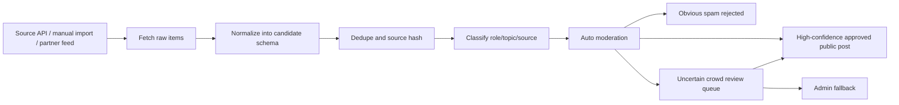

# Source Ingestion Strategy

## Goal

Replace fake data with a compliant, reviewable source ingestion pipeline for academic opportunities from X, LinkedIn, Xiaohongshu, lab pages, newsletters, and community submissions.

The key rule: ingestion may only publish directly when the automatic score is high-confidence and auditable. Everything else must remain hidden until crowd consensus or admin review.

See [Agent Ingestion Strategy](./agent-ingestion-strategy.md) for the scheduled agent architecture. Agents should orchestrate approved connectors and research workflows, not bypass platform restrictions.

## Target Pipeline



## Data Flow

1. Scheduled collector fetches source posts by query, account, list, or manual URL.
2. Raw item is stored or transformed into a candidate.
3. Candidate is normalized into OpenPosition fields.
4. Source hash and URL are used to detect duplicates.
5. Candidate is evaluated by AI moderation when `OPENAI_API_KEY` is configured.
6. High-confidence academic opportunities can publish immediately.
7. Obvious spam is rejected immediately.
8. Uncertain candidates enter `pending + hidden` for crowd review.
9. Deterministic rules are used as fallback when AI is unavailable.
10. Admin handles low-confidence or disputed cases.

## Source Priority

### 1. X / Twitter

Recommended path:

- Use the official X API recent search endpoint for the last 7 days.
- For historical backfill, use full-archive search if the account/plan supports it.
- Store the original post ID and source URL.
- Query with narrow academic recruiting terms and exclude retweets/replies when needed.

Example query themes:

```txt
("PhD position" OR "PhD opening" OR "recruiting PhD") ("machine learning" OR AI OR robotics) -is:retweet
("postdoc" OR "postdoctoral") ("NLP" OR "computer vision" OR "AI") -is:retweet
("research intern" OR internship) ("LLM" OR "machine learning") -is:retweet
```

Required local env:

```env
X_BEARER_TOKEN=
```

Implementation notes:

- Add `api/ingestion/x.ts`.
- Fetch `GET /2/tweets/search/recent`.
- Request expansions for author when useful.
- Respect rate limits and backoff on 429.
- Do not scrape HTML when the API can satisfy the workflow.

References:

- X Search Posts documentation: https://docs.x.com/x-api/posts/search/introduction
- X Recent Search quickstart: https://docs.x.com/x-api/posts/search/quickstart/recent-search
- X Rate Limits: https://docs.x.com/x-api/fundamentals/rate-limits

### 2. LinkedIn

Recommended path:

- Do not plan on broad public LinkedIn search scraping as the primary ingestion path.
- Use official LinkedIn APIs only where your app has approved access and permissions.
- Prefer user-submitted LinkedIn URLs, lab/personal reposts, or partner workflows.
- If a professor submits a LinkedIn post URL, store it as source and let moderation normalize the post.

Required local env if approved API access exists:

```env
LINKEDIN_ACCESS_TOKEN=
```

Implementation notes:

- LinkedIn APIs are permissioned and use member/organization scopes.
- Treat LinkedIn as "source URL and user-submitted evidence" until API access is approved.
- Avoid cookie/session automation against LinkedIn; it is brittle and high-risk.

Reference:

- LinkedIn UGC Post API: https://learn.microsoft.com/en-us/linkedin/compliance/integrations/shares/ugc-post-api

### 3. Xiaohongshu / RedNote

Recommended path:

- Start with manual submission and moderator-assisted import.
- Use source URLs from Xiaohongshu posts when users submit them.
- For automated collection, prefer a licensed data provider or explicit platform/partner authorization.
- Keep all imported Xiaohongshu content in the review queue.

Required local env if using an approved provider:

```env
XHS_PROVIDER_API_KEY=
XHS_PROVIDER_BASE_URL=
```

Implementation notes:

- Xiaohongshu does not expose a broadly available public search API comparable to X recent search.
- Third-party APIs exist, but they should be reviewed for legality, reliability, data rights, and platform compliance.
- Do not build a hidden browser/cookie scraper into the production system without legal and operational review.

### 4. Lab Pages, Personal Sites, Newsletters

Recommended path:

- Support manual URL import first.
- Add lightweight fetchers for RSS, static HTML pages, and newsletter archives later.
- These sources are often higher-trust than social feeds and easier to verify.

Potential env:

```env
INGESTION_ADMIN_SECRET=
```

## Candidate Model

V0 can use the existing `posts` table directly by inserting candidates as:

```txt
moderationStatus = pending
visibilityStatus = hidden
verifiedStatus = unverified
source = X / LinkedIn / RedBook / Other
originalUrl = source URL
originalText = raw text
sourceHash = normalized source identity
```

Auto-review writes to `moderationReviews`, and uncertain candidates can accumulate `crowdVotes`. This gives every automated or crowd decision an audit trail.

Future scale may justify a separate `sourceCandidates` table, but it is not required before the moderation queue works.

## Deduping Strategy

Use layered duplicate checks:

1. Exact `originalUrl`.
2. Exact source platform ID.
3. `sourceHash`.
4. Similar title + institution + author.
5. Similar original text.

V0 only needs exact URL/source hash checks.

## Normalization Strategy

Use simple deterministic extraction first:

- source platform
- author name
- original URL
- original text
- title guess
- institution guess
- tags from keywords
- position type from keyword rules

Later, add AI extraction behind moderation:

- use an LLM to suggest title, summary, role type, institution, deadline, and tags
- auto-publish only when deterministic source checks and moderation confidence are high
- send weak or conflicting AI results to crowd/admin review
- show extracted fields and reasons to admin for approval

## Recommended Build Order

1. Finish automated moderation, crowd review, and admin fallback.
2. Add manual URL import form for admins.
3. Add X recent search collector.
4. Add source hash duplicate warnings.
5. Add AI-assisted metadata extraction and confidence scoring.
6. Add provider-backed Xiaohongshu ingestion if a compliant provider is selected.
7. Add LinkedIn ingestion only through approved API access, submitted URLs, or partnerships.

## Local Configuration

Add keys to `.env` when available:

```env
X_BEARER_TOKEN=
LINKEDIN_ACCESS_TOKEN=
XHS_PROVIDER_API_KEY=
XHS_PROVIDER_BASE_URL=
INGESTION_ADMIN_SECRET=
OPENAI_API_KEY=
OPENAI_MODERATION_MODEL=gpt-5.4-mini
```

Leave these blank locally until accounts or providers are ready. The app should not require them for normal browsing, submitting, or moderation.

## Compliance Rules

- Prefer official APIs and explicit authorization.
- Always store original URL and source platform.
- Do not publish imported content without moderation.
- Respect rate limits and terms.
- Track source checked time.
- Build removal and expiry workflows before broad ingestion.
